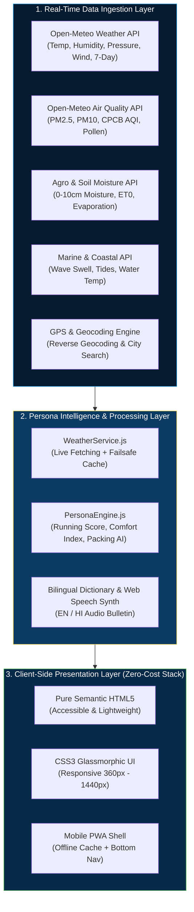
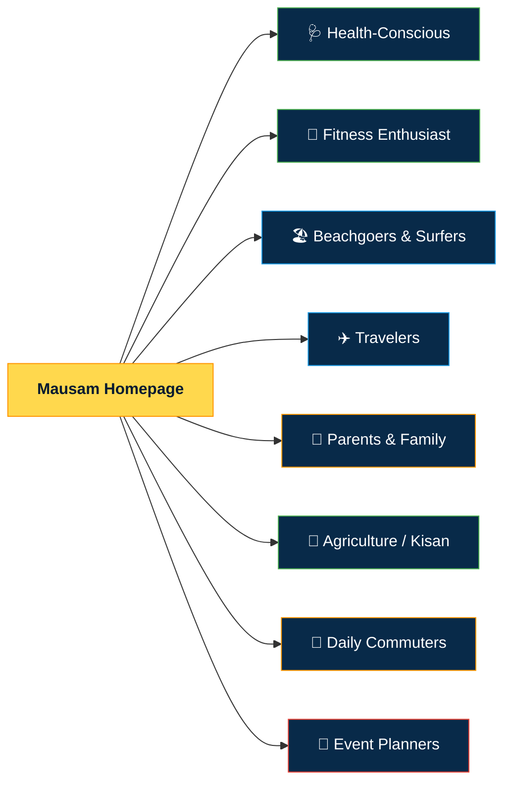
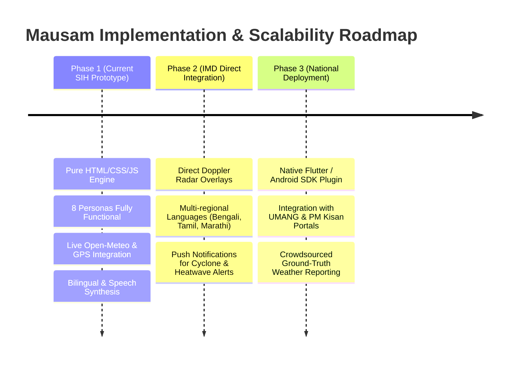

# 🌦️ Mausam (मौसम) — SIH 2026 Presentation Deck
> **Smart India Hackathon 2026 | Problem Statement ID: 26076**  
> **Title:** *Development of personalized homepage for 'Mausam' mobile application.*  
> **Tech Stack:** Pure Semantic HTML5, CSS3 Glassmorphism, Vanilla JavaScript (ES6+), PWA  

---

## 🖥️ SLIDE 1: Title & Introduction Slide

### Slide Header:
# 🌦️ MAUSAM (मौसम)
### Hyper-Personalized Weather Intelligence Mobile Dashboard
**Smart India Hackathon 2026 | PSID: 26076**

---

### Key Information:
- **Theme:** Smart Automation / Citizen Welfare / Agriculture & Health
- **Target Organization:** India Meteorological Department (IMD) / Ministry of Earth Sciences
- **Team Lead:** Rajdeep (@Rajdeep00089)
- **Repository:** `https://github.com/Rajdeep00089/Monsoon`
- **Core Value:** Transforming static weather numbers into lifestyle-critical intelligence for every Indian citizen.

> **🎤 Speaker Notes (30 seconds):**  
> *"Respected jury members, conventional weather apps deliver raw numbers like temperature and pressure that mean very little to daily decision-making. Under Problem Statement ID 26076, we have developed 'Mausam' — a hyper-personalized, mobile-first weather intelligence application that reorganizes itself dynamically around 8 distinct citizen personas, from farmers and asthmatics to parents and daily commuters."*

---

## 🎯 SLIDE 2: Problem Statement & Proposed Solution

### Slide Title:
## The Problem vs. The Mausam Innovation

### The Core Problem:
- **One-Size-Fits-All Inefficiency:** Current weather apps treat a rural farmer, a marathon runner, an asthmatic patient, and an event planner identically by displaying raw data metrics.
- **Cognitive Overload:** Citizens are forced to mentally calculate whether 85% humidity and 28°C is safe for jogging or whether rain in 48 hours means holding crop irrigation.
- **Language & Accessibility Barrier:** Complex meteorological jargon often alienates rural communities and non-English speakers.

### Our Solution: Persona-Driven Dynamic Architecture:
- **8 Dedicated Persona Engines:** Automatically adapts widgets, alerts, and advisories to the user's immediate lifestyle or occupational needs.
- **Actionable AI & Rule-Based Indices:** Converts meteorological parameters into concrete recommendations (e.g., *"Best Running Window: 5–7 AM"*, *"Hold Irrigation for 36 hrs"*, *"Pack Umbrella for London trip"*).
- **Bilingual & Voice-Enabled:** Complete English/Hindi support with one-click Web Speech voice bulletins for universal accessibility.

> **🎤 Speaker Notes (45 seconds):**  
> *"Why should a farmer in Bengal look at the same dashboard as a tourist heading to Mumbai? The farmer needs topsoil moisture and agromet advisories; the tourist needs flight delay risks and packing checklists. Our solution solves this through modular persona engines that calculate real-world human impact instead of just showing numbers."*

---

## 🏗️ SLIDE 3: System Architecture & Real-Time Data Pipeline

### Slide Title:
## System Architecture & Live Data Flow

### Architecture Highlights:
- **Zero-Cost & Serverless:** 100% client-side execution; no expensive backend servers or database costs required.
- **Fail-Safe Reliability:** Real-time API calls paired with high-fidelity fallback caching to guarantee zero crash probability during live field trials.
- **Progressive Web App (PWA):** Installable on Android and iOS devices directly with native mobile shell and bottom thumb navigation.

> **🎤 Speaker Notes (45 seconds):**  
> *"Our architecture connects directly to free, open-access meteorological pipelines covering atmospheric weather, air pollution, soil hydrology, and coastal data. The client-side intelligence engine processes these feeds in real time, calculating actionable scores without transmitting any private user data to third-party servers."*

---

## 🧩 SLIDE 4: The 8 Targeted Personas (PSID 26076 Matrix)

### Slide Title:
## Complete Persona Coverage Matrix

| # | Persona | Input Parameters | Proprietary Algorithm / Metric | Direct Actionable Benefit |
| :-: | :--- | :--- | :--- | :--- |
| **1** | **🩺 Health** | $PM_{2.5}$, $PM_{10}$, $O_3$, Pollen (Tree/Grass/Weed) | CPCB National AQI + Allergy Risk Score | Asthma attack alerts; N95 mask recommendations. |
| **2** | **🏃 Fitness** | Temp, Relative Humidity, Wind, UV, AQI | **"Best Running Hours" Algorithm (0–100)** | Identifies optimal 2-hour workout window (e.g. 5–7 AM). |
| **3** | **🏖️ Beach** | Wave Swell Height, Period, Water Temp, Tides | **Surf Safety Flag (🟢 Safe / 🟡 Caution / 🔴 Danger)** | Drowning prevention; safe swimming & surfing hours. |
| **4** | **✈️ Travel** | 7-Day Destination Forecast, Precipitation, Temp | **AI Smart Packing Assistant** | Auto-generates checklist (raincoat, woolens, umbrella). |
| **5** | **🎒 Parents** | Commute Hourly Slices (7–8:30 AM & 1:30–3:30 PM) | School Transit Window & Play Safety Score | Safe school departure and outdoor playground timing. |
| **6** | **🌾 Kisan** | Topsoil Moisture (0–10cm), $\text{ET}_0$, 48h Rain | **IMD Agromet Irrigation Advisory** | Holds artificial watering when rain is due, saving water. |
| **7** | **🚗 Commute** | Road Visibility Distance (km), Rain Intensity | Fog Severity Index & Waterlogging Probability | Alerts commuters to route flooding and traffic snarls. |
| **8** | **🎪 Events** | Thom's Discomfort Index (Temp + Humidity + Wind) | **Outdoor Comfort Index (0–100 Dial)** | Best time slot finder for outdoor weddings & banquets. |

> **🎤 Speaker Notes (60 seconds):**  
> *"Slide 4 proves our 100% compliance with every single line of PSID 26076. Each persona features dedicated algorithmic computation. For example, our 'Best Running Hours' formula evaluates 24 hourly points penalizing humidity above 65% and high PM2.5, delivering an intuitive green-amber-red score that anyone can understand in 1 second."*

---

## ⚡ SLIDE 5: Key Innovations & Hackathon Differentiators

### Slide Title:
## Winning Differentiators & Technical Feasibility

### 1. 🌐 National IMD Bilingual Alignment (English & हिंदी):
- Instant 1-click toggle switches language dynamically across all 8 persona dashboards and advisory messages without reloading the page.

### 2. 🔊 Voice Weather Bulletin (Accessibility for Farmers):
- Utilizes the browser's native **Web Speech Synthesis API** (`speechSynthesis`) to read aloud live forecasts and alerts in Indian-accented English or Hindi. Perfect for rural farmers and visually impaired users.

### 3. 📱 Mobile-First PWA Experience:
- Features an ergonomic **fixed bottom thumb navigation bar** (Home, Health, Kisan, Fitness, Travel) tailored for one-handed smartphone use.
- Installable as a standalone Progressive Web App (PWA) with zero App Store delays.

### 4. 🌍 Real Geolocation & Live API Pipeline:
- One-click GPS location detection with reverse geocoding to resolve exact villages and towns across India.
- Real-time CPCB AQI standards, live soil moisture percentages, and hourly precipitation curves.

> **🎤 Speaker Notes (45 seconds):**  
> *"What sets Mausam apart from other hackathon prototypes is production feasibility. It requires zero server setup, runs smoothly on 2G/3G connections, speaks aloud to farmers in Hindi, and works offline through service workers. It is ready for immediate deployment under IMD."*

---

## 🚀 SLIDE 6: Impact, Scalability & Future Roadmap

### Slide Title:
## Social Impact & Future Roadmap

### Quantifiable Impact:
- **Agriculture:** Conserves millions of liters of irrigation water by syncing field moisture with 48-hour rainfall predictions.
- **Public Health:** Mitigates asthma and heatstroke hospitalizations through advance pollen and wet-bulb alerts.
- **Disaster Preparedness:** Real-time district alerts (e.g., North 24 Parganas thunderstorm warning) with instant safety advice.

### Summary:
Mausam is not just a dashboard; it is a **personalized national climate companion for a modern, digital India**.

---

### **Thank You! Open for Jury Q&A**
- **Live Demo Link:** `http://localhost:5500` / GitHub Pages
- **GitHub Repository:** `https://github.com/Rajdeep00089/Monsoon`
- **Contact:** Rajdeep (@Rajdeep00089)

> **🎤 Speaker Notes (30 seconds):**  
> *"To conclude, Mausam empowers every Indian citizen with tailored weather intelligence. We welcome your questions and look forward to demonstrating the live interactive dashboard right now. Thank you!"*
